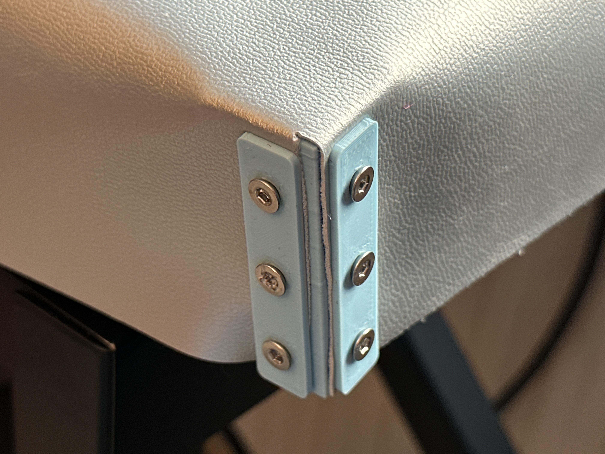
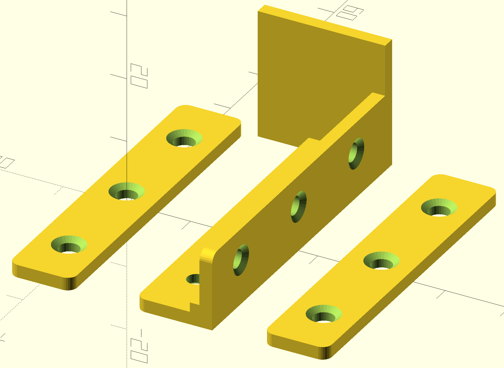
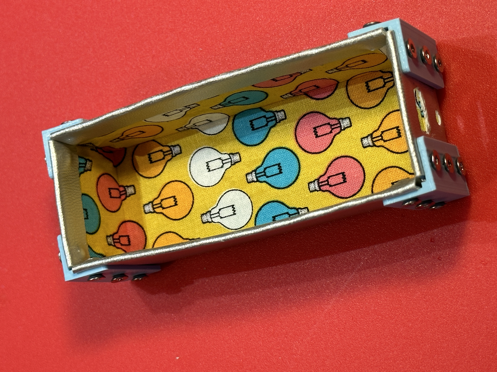
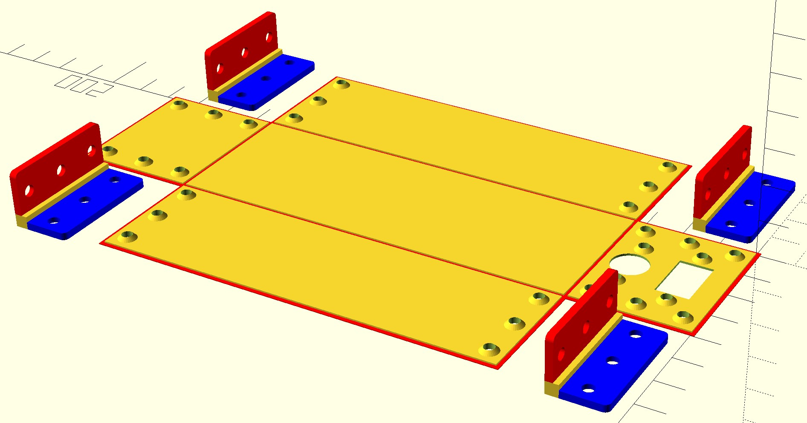

# Covers and Cases
Making covers and cases using 3D printed elements to make panels and corners. 



## Cover Corners
Create a corner for a cover. 

The script CornerCoversWithTop can be used to create inner corners with fixing strips to make corners for covers. 
```
// set the depth of the corner and the hole spacing in mm
corner(depth=50,holeSpacing=15);
```

## Cases


The cases are made using 3D printed panels which are covered on one side with a lining material and on the other with an outer material. They are printed flat and then the sides are folded into position and held in place with 3D printed corners.



The script PartyCamCover creates a cover for the Party Camera described here: https://github.com/CrazyRobMiles/ESP32-Printing-party-camera You can modify it to produce cases for your devices. 


## I've got your corner

This is not part of any design. But you might find it useful. The script ThreeWayCorner will produce a 3D corner with specified lengths in X, Y and Z.
```
corner3D(x=40,y=40,z=40,holeSpacing=12);
```
This statement makes the corner shown above. 

Have fun.

Rob Miles